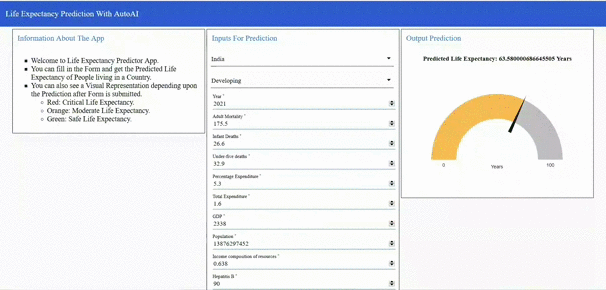
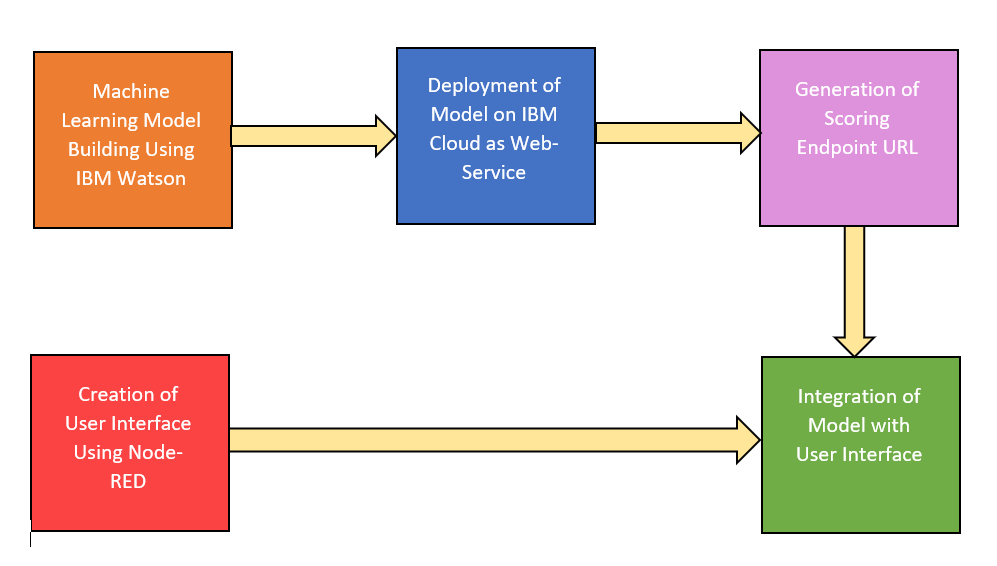
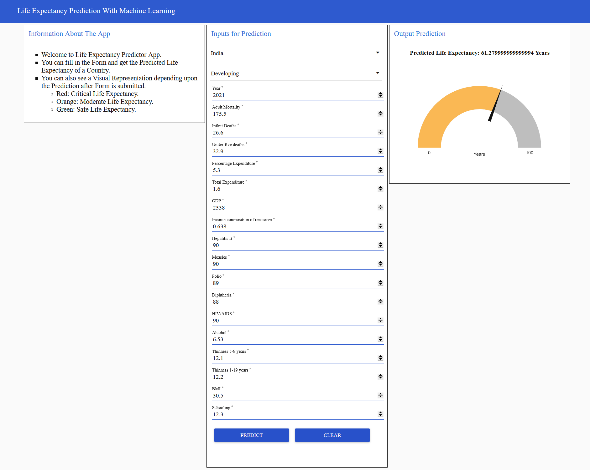

# Predicting Life Expectancy Using Machine Learning

Life Expectancy of a person is a statistical measure of the average time he/she is expected to live, based on several factors. Life Expectancy depends upon factors such as: Regional Variations, Economic Circumstances, Sex Differences, Mental Illnesses, Physical Illnesses, Education, Year of Birth and various other Demographic Factors.

Calculating Life Expectancy will require a sophisticated system that will take into account all these factors. With Machine Learning and services such as IBM Watson this has now become possible.
 The goal of this project is to predict the Average Life Expectancy of people living in a country given certain factors consisting of Social, Economical, Immunization, Mortality Factors.

A typical Regression Machine Learning project leverages historical data to predict insights into the future. This problem statement is aimed at predicting Life Expectancy rate of a country given various features.
For the Life Expectancy prediction, user will have to give input values of various features and after analyzing these features, the Machine Learning model will pass its prediction to the user and also indicate whether the predicted value is Safe Life Expectancy Rate, or the country needs to improve its factors.

## Video Demonstration 
<html><body>
<a href="https://drive.google.com/file/d/1U3j-DaKgO-MHWvYrSdrVNsM3DwlvUbii/view?usp=sharing">Click Here To Watch The Video Demonstration</a>  

</body></html>
  
## Flow
The web-app has IBM Watson Machine Learning as its backend service and Node-RED for the User Interface development. The web-app has been deployed on IBM Cloud as a Web Service. Basic Flow is as follows:
<html><body></body></html>

## IBM Watson Machine Learning
The Dataset and Notebooks are available <html><body><a href="IBM Watson Project/assets">HERE</a>.  

## Node-RED Flow
The JSON File for Node-RED Flow is available <html><body><a href="Node-RED Flow/flows.json">HERE</a>.  
</body></html>

## Result
Removal of feature Population yielded better results. Replacement of missing values enabled the model to learn more examples and generalize well. 
ExtraTreesRegresssor was the top-performer in all the experiments. The RMSE and R2 scores of Machine Learning and AutoAI Model are as follows:  
<html><body>
 <table>
  <tr><th>Metrics</th><th>Machine Learning Model</th><th>AutoAI Model</th></tr>
  <tr><td>R2 Score</td><td>0.9635483479199352</td><td>0.96050013469328</td></tr>
  <tr><td>RMSE</td><td>1.7714090404600051</td><td>1.829561183885059</td></tr>
 </table>
 </body></html>
The testing results convinced that the trained model has generalized well and can give better predictions to a great extent.

## Advantages & Disadvantages
The following can be the Advantages:<html><body>  
●	Predicting Life Expectancy has the potential to benefit individuals, health service providers and governments. 
●	The web-app provides user-friendly interface, it also displays the necessary information about the app so that the user understands what he has to do and how the app will work accordingly. 
●	The prediction is returned to user in a short-time and user is intended about the prediction through notification. The prediction is also outputted in the web-app and a visual representation about the same is shown. </body></html>

The following can be the Disadvantages:<html><body>  
●	The web-app is not handy to use for users as it is not a mobile app. 
●	The user has to input all the fields and only then the prediction will be given to the user. However, inputting all these values is a tiresome job, and the user cannot input these values through speech. </body></html>

## Applications
The following can be the Applications:<html><body>  
●	People can become more aware of their general health and improvise on it. Insurance Companies can use these predictions to provide individualized services. 
●	Governments can use predictions to allocate limited resources efficiently. Social welfare, Health-care funding to individuals and in areas of greater needs can be assigned effectively. 
●	It can benefit for policy making, and help optimize an individual’s health, or the services they receive. </body></html>

## Conclusion
The web-app has been built successfully yielding good results. It is well-integrated with IBM Watson and Node-RED. The web-app is available <html><body><a href="https://life-expectancy-prediction-app.mybluemix.net/ui/">HERE</a></body></html>.
There still can be more improvements in the model by doing Feature Engineering, creating a Mobile App instead of a web-app, Enabling speech input to the model for better convenience.
<html><body></body></html>

## Future Scope
The following can be the Improvements and Future Scope:<html><body>  
●	Making the model more accurate, doing more relevant feature extraction. 
●	Creating a mobile app for more convenience. 
 ●	Modifying the model so that it will accept speech-driven inputs too. </body></html>
